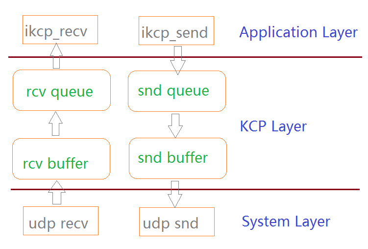

# KCP 学习文档

这是我总结的 KCP 学习文档，希望对大家有所帮助。

## 预备知识

准备开始阅读 KCP 的 C 语言源码之前，需要对一些基本概念有所认知。

### ARQ

KCP 的英文介绍是：A Fast and Reliable ARQ Protocol，一个快速可靠的 ARQ 协议。所以，什么是 ARQ 呢？

ARQ 就是自动重复请求（Automatic Repeat Request）。

传统自动重传请求分成为三种，即停等式(stop-and-wait）ARQ，回退n帧（go-back-n）ARQ，以及选择性重传（selective repeat）ARQ。TCP 协议使用的是第二种 stop-and-wait ARQ 的变种。详细介绍就不在这里说了，请自行百度或者 Google。

所以简单说，ARQ 就是一种在不可靠通道中进行可靠传输的方法。

### TCP 滑动窗口

TCP 是如何进行可靠的数据传输呢？前面已经说了，是通过 ARQ stop-and-wait 的一个变种算法实现的，这个算法的实现有一个很关键的概念就是滑动窗口。

滑动窗口分为发送窗口和接受窗口。

发送窗口：

接收窗口：

[图片出处](http://www.tcpipguide.com/free/t_TCPSlidingWindowAcknowledgmentSystemForDataTranspo-6.htm)

上面这两张图已经说得很明白了。ARQ 的各种算法，以及 KCP 的具体实现，都需要在这两张图的概念下进行展开。

### 英文缩写

这一步也算是比较关键吧，对于缺少相关概念的人来说，源码中的很多缩写命名可能十分让人费解，所以我就在这里汇总一下。

 缩写 |             全拼          |                      解释
------|---------------------------|----------------------------------------------
 snd  | send/sender               | 发送/发送者
 rcv  | receive/receiver          | 接收/接收者
 nxt  | next                      | 下一个，这个缩写一般用在 snd.nxt 或者 rcv.nxt 这两个指针上，详情参考上一节的发送窗口和接收窗口
 wnd  | window                    | 窗口（大小）
 una  | unacknowledged            | 未确认的窗口指针（请参考上一节中的发送窗口）
 ack  | acknowledge               | 确认，这个表示接收者受到数据后给发送者的应答
 psh  | push                      | psh 表示推送数据
 mtu  | maximum transmission unit | 最大传输单元，这个表示在一个特定的硬件链路上，一个 IP 包的最大长度（字节）
 mss  | maximum segment size      | mtu - 20 - tcp/kcp header，比如 1500 的 mtu，则 tcp 的 mss 为 1460（1500 - 20 - 20）
 rto  | round-trip timeout        | 表示发出数据后等待对方ack的超时
 rtt  | round-trip time           | 从一个数据发出，到收到对应的 ack 这之间的时间间隔 
 srtt | smoothed rtt              | 平滑后的 rtt
 sn   | serial number             | 表示这个数据包的序列号，每个包都有递增的sn
 conv | conversation              | 会话号，一个 kcp 连接用的是 conv 标识的
 cmd  | command                   | 这个表示这个 segment 是干嘛的，ack 表示确认，psh 表示推送数据
 ts   | timestamp                 | 时间戳，这个表示从 1970 年 1 月 1 日（00:00:00 GMT）以来的秒数
 frg  | fragment                  | 数据分片，如果 kcp 是 stream 模式，则所有的数据包 frg 都是 0，否则一个大数据包将依据mss被拆成若干小包，他们的frag依次递增
 cwnd | congestion window         | 拥塞窗口，这个概念很关键，如果这个不懂，就不能说理解了 tcp
 seg  | segment                   | 数据包在网络层级中不同的地方名字也不同，在链路层比如以太网，数据叫帧（frame），往上到 IP 层叫包（packet），再往上到 tcp/kcp 这层就叫数据段（segment），UDP 中叫数据报（datagram）

### KCP 的数据缓冲区

KCP 协议的实现中有四个缓冲区，每个缓冲区都是用的循环双向链表这种数据结构。具体的数据流向如下：

